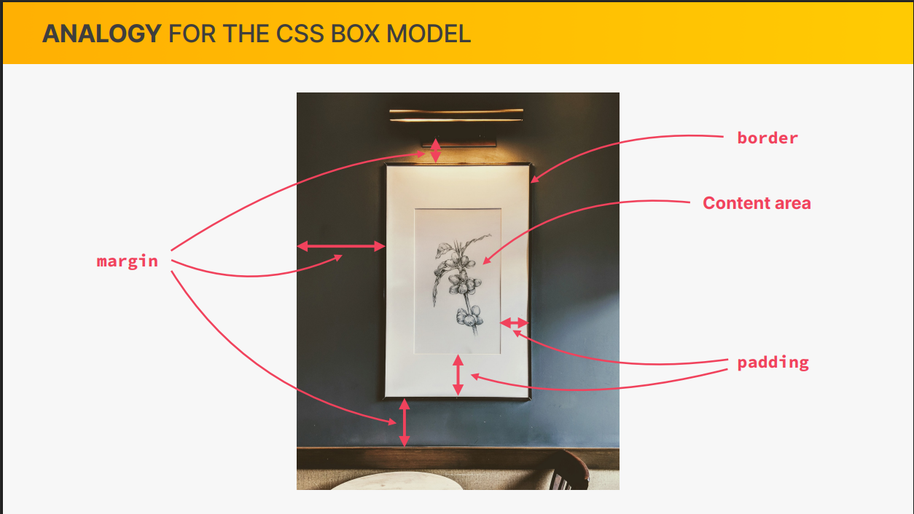
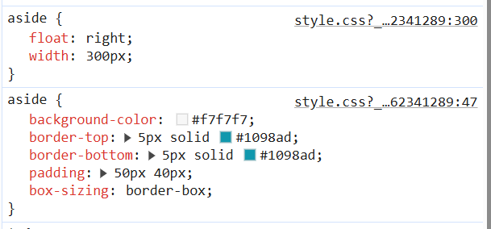
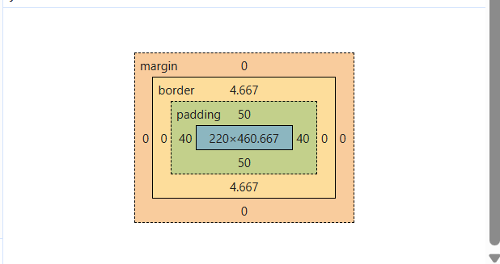
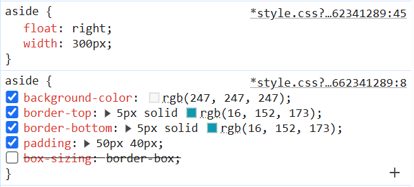
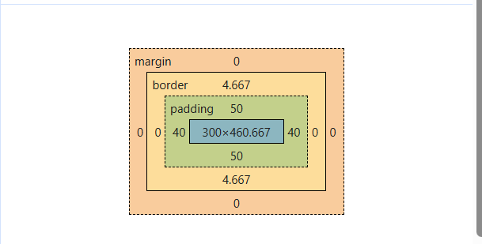
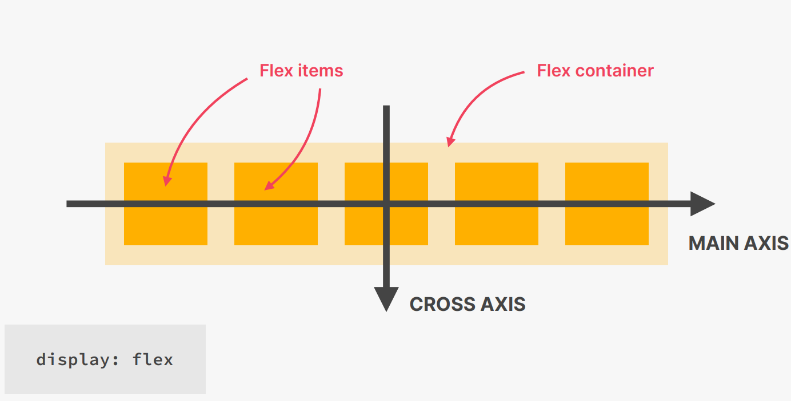
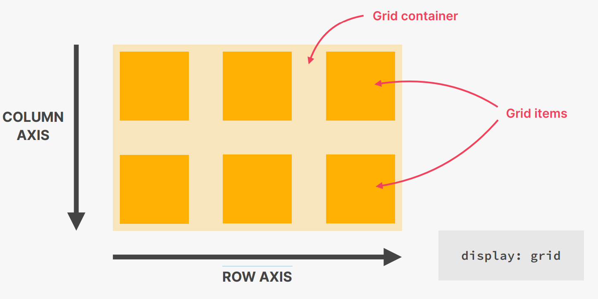
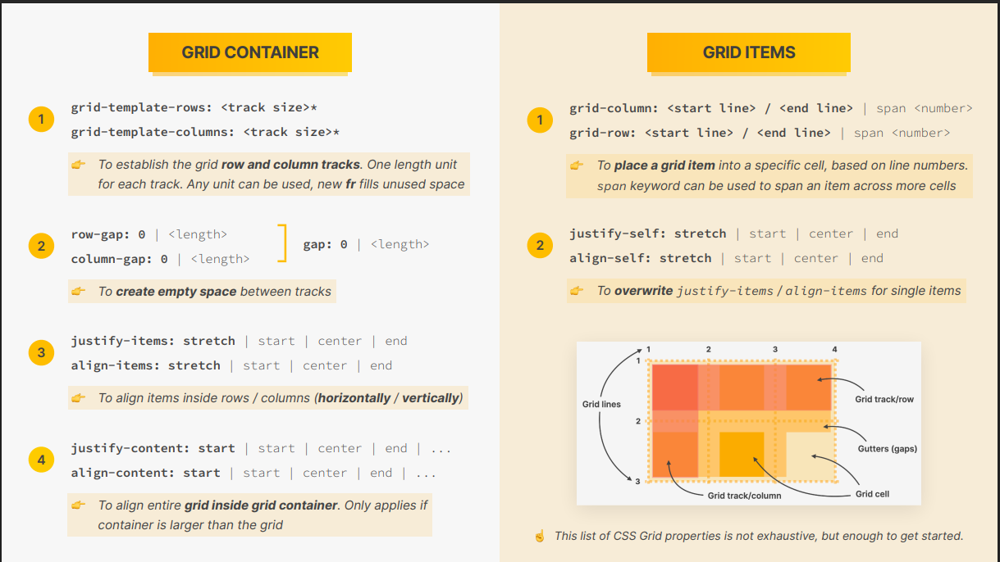
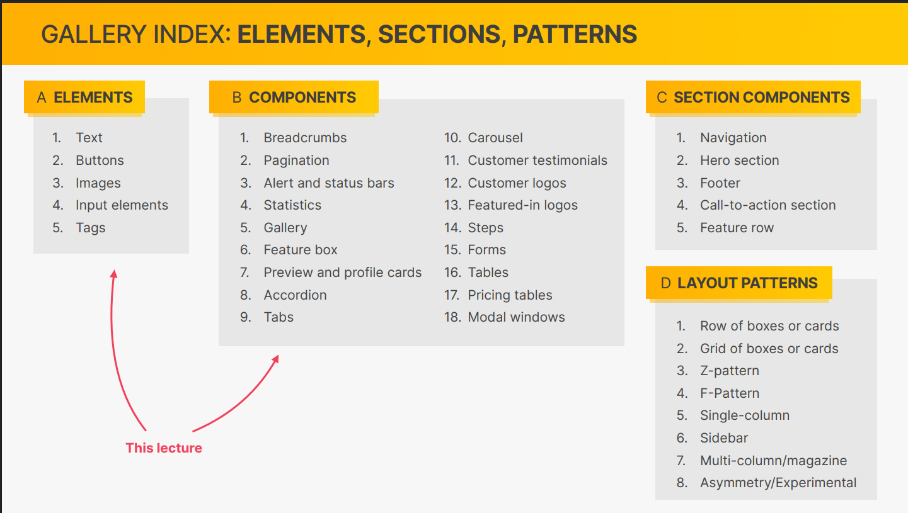
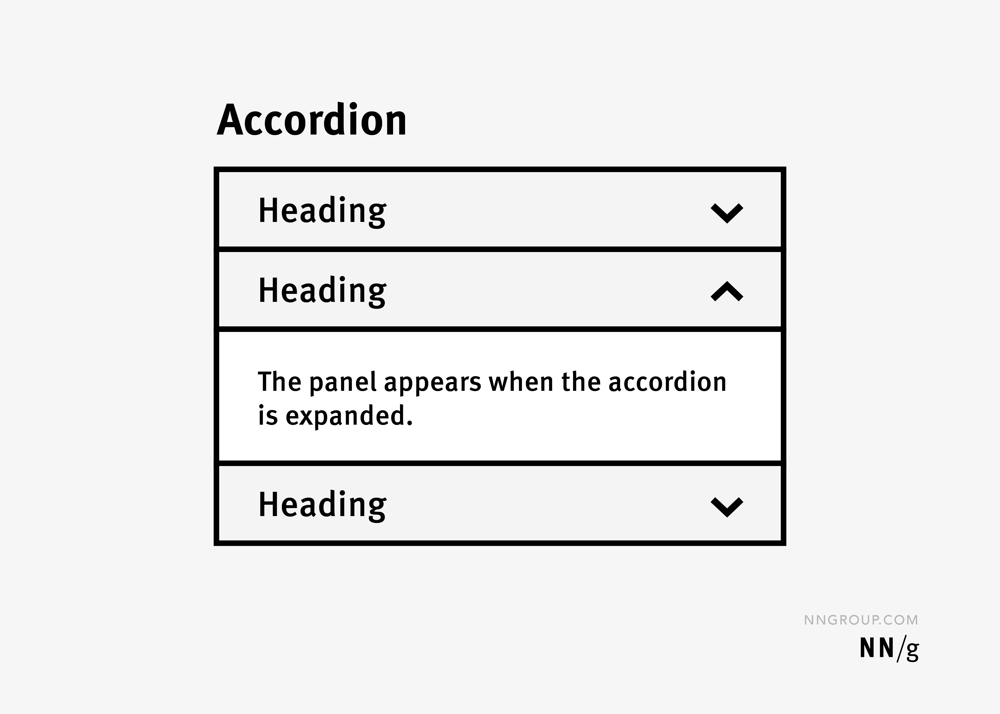

- [Section 1: CSS FUNDAMENTALS](#section-1-css-fundamentals)
  - [WHAT IS CSS?](#what-is-css)
  - [A CSS SYNTAX](#a-css-syntax)
  - [HOW TO ADD CSS](#how-to-add-css)
    - [External CSS](#external-css)
    - [Internal CSS](#internal-css)
    - [Inline CSS](#inline-css)
  - [STYLING TEXT](#styling-text)
  - [CSS Selectors](#css-selectors)
    - [CSS Combinators](#css-combinators)
      - [Simple selectors](#simple-selectors)
      - [Descendant combinator (space)](#descendant-combinator-space)
      - [Child Combinator (\>)](#child-combinator-)
      - [Next Sibling Combinator (+)](#next-sibling-combinator-)
      - [Subsequent-sibling Combinator (~)](#subsequent-sibling-combinator-)
    - [CSS Pseudo-classes](#css-pseudo-classes)
    - [CSS Pseudo-elements](#css-pseudo-elements)
    - [CSS Attribute Selectors](#css-attribute-selectors)
      - [CSS \[attribute\] Selector](#css-attribute-selector)
      - [CSS \[attribute="value"\] Selector](#css-attributevalue-selector)
      - [CSS \[attribute~="value"\] Selector](#css-attributevalue-selector-1)
      - [CSS \[attribute|="value"\] Selector](#css-attributevalue-selector-2)
      - [CSS \[attribute^="value"\] Selector](#css-attributevalue-selector-3)
      - [CSS \[attribute$="value"\] Selector](#css-attributevalue-selector-4)
      - [CSS \[attribute\*="value"\] Selector](#css-attributevalue-selector-5)
  - [DEFINING COLORS IN CSS](#defining-colors-in-css)
    - [RGB / RGBA NOTATION](#rgb--rgba-notation)
    - [HEXADECIMAL NOTATION](#hexadecimal-notation)
  - [CONFLICTING SELECTORS AND DECLARATIONS](#conflicting-selectors-and-declarations)
    - [Important CSS rule](#important-css-rule)
  - [CSS inheritance](#css-inheritance)
    - [Basic Concept](#basic-concept)
    - [Using Inheritance on body](#using-inheritance-on-body)
    - [Inheritance on a Smaller Scale](#inheritance-on-a-smaller-scale)
    - [Not All Properties Are Inherited](#not-all-properties-are-inherited)
    - [Universal Selector vs. body](#universal-selector-vs-body)
    - [Key Takeaways](#key-takeaways)
  - [Types of boxes in CSS](#types-of-boxes-in-css)
    - [Block-level Boxes](#block-level-boxes)
    - [INLINE ELEMENTS](#inline-elements)
    - [INLINE-BLOCK BOXES](#inline-block-boxes)
  - [ABSOLUTE POSITIONING](#absolute-positioning)
    - [Normal Flow (default flow)](#normal-flow-default-flow)
    - [ABSOLUTE POSITIONING](#absolute-positioning-1)
    - [Example](#example)
  - [THE CSS BOX MODEL](#the-css-box-model)
- [Section 2: LAYOUTS: FLOATS, FLEXBOX, AND CSS GRID FUNDAMENTALS](#section-2-layouts-floats-flexbox-and-css-grid-fundamentals)
  - [WHAT DOES “LAYOUT” MEAN?](#what-does-layout-mean)
    - [Layout](#layout)
    - [THE BOX MODEL WITH BOX-SIZING: BORDER-BOX](#the-box-model-with-box-sizing-border-box)
    - [THE 3 WAYS OF BUILDING LAYOUTS WITH CSS](#the-3-ways-of-building-layouts-with-css)
      - [FLOAT LAYOUTS](#float-layouts)
        - [ABSOLUTE POSITIONING VS. FLOATS](#absolute-positioning-vs-floats)
        - [The CSS clear Property](#the-css-clear-property)
        - [CLEARING FLOAT](#clearing-float)
      - [FLEXBOX](#flexbox)
        - [WHAT IS FLEXBOX?](#what-is-flexbox)
        - [DECLARE FLEXBOX](#declare-flexbox)
        - [Flex vs Inline-Flex — Quick Notes](#flex-vs-inline-flex--quick-notes)
        - [FLEXBOX TERMINOLOGY](#flexbox-terminology)
        - [FLEX CONTAINER](#flex-container)
        - [Flex Container Properties](#flex-container-properties)
        - [FLEX ITEMS](#flex-items)
        - [FLEX ITEMS PROPERTIES](#flex-items-properties)
      - [CSS GRID](#css-grid)
        - [WHAT IS CSS GRID?](#what-is-css-grid)
        - [DECLARE GRID](#declare-grid)
        - [`grid` vs `inline-grid`— Quick Notes](#grid-vs-inline-grid-quick-notes)
        - [BASIC CSS GRID TERMINOLOGY](#basic-css-grid-terminology)
        - [MORE CSS GRID TERMINOLOGY](#more-css-grid-terminology)
        - [NEW IN GRID](#new-in-grid)
          - [auto](#auto)
          - [Fractional unit](#fractional-unit)
          - [repeat() Function](#repeat-function)
          - [minmax() Function](#minmax-function)
          - [fit-content() Function](#fit-content-function)
        - [GRID CONTAINER](#grid-container)
        - [GRID CONTAINER PROPERTIES](#grid-container-properties)
        - [GRID ITEMS](#grid-items)
        - [GRID ITEMS PROPERTIES](#grid-items-properties)
- [Section 3: Components and Layout patterns](#section-3-components-and-layout-patterns)
  - [Building an Accordion Component](#building-an-accordion-component)
    - [Hero icons](#hero-icons)
    - [Open color](#open-color)
    - [`line-height`](#line-height)
    - [`stroke` property](#stroke-property)
    - [`box-shadow`](#box-shadow)
  - [Building an Carousel Component](#building-an-carousel-component)

# Section 1: CSS FUNDAMENTALS

## WHAT IS CSS?

- Cascading Style Sheets
- CSS describes the visual style and presentation of the content
  written in HTML
- CSS consists of countless properties that developers use to format
  the content: properties about font, text, spacing, layout, etc

## A CSS SYNTAX

```
h1 {
 color: blue;
 text-align: center;
 font-s
}

```

## HOW TO ADD CSS

### External CSS

```
<!DOCTYPE html>
<html>
  <head>
    <link rel="stylesheet" href="mystyle.css" />
  </head>
  <body>
    <h1>This is a heading</h1>
    <p>This is a paragraph.</p>
  </body>
</html>
```

### Internal CSS

```
<!DOCTYPE html>
<html>
  <head>
    <style>
      body {
        background-color: linen;
      }

      h1 {
        color: maroon;
        margin-left: 40px;
      }
    </style>
  </head>
  <body>
    <h1>This is a heading</h1>
    <p>This is a paragraph.</p>
  </body>
</html>
```

### Inline CSS

```
<!DOCTYPE html>
<html>
    <body>
        <h1 style="color:blue;text-align:center;">This is a heading</h1>
        <p style="color:red;">This is a paragraph.</p>
    </body>
</html
```

## STYLING TEXT

- **font-size**: Property is used to specify the size of the text/font.

  - Absolute sizes:px:

    - Pixels offers fixed and precise control over the font size.-
    - xx-small, x-small, small, medium, large, x-large, xx-large. These keywords has a predefined set of sizes in browsers.

  - Relative sizes:
    - em: This unit is relative to the font size of the parent element.
    - rem: This unit is relative to the font size of the root HTML element.
    - %: This unit is relative to the font size of the parent element
      smaller and larger: These units adjust the font size relative to the parent element.

```
<div style="font-size: 20px;">
  <p style="font-size: 1.5em;">Text này = 1.5 × 20px = 30px</p>
</div>
```

```
<html style="font-size: 16px;">
  <div style="font-size: 40px;">
    <p style="font-size: 2rem;">Text này = 2 × 16px = 32px</p>
  </div>
</html>
```

```
<div style="font-size: 20px;">
  <p style="font-size: 150%;">Text này = 150% × 20px = 30px</p>
</div>

```

```
h1 {
  font-size: 40px;
}
```

```
p.normal {
  font-style: normal;
}
```

```
p.a {
  font-family: "Times New Roman", Times, serif;
}

p.b {
  font-family: Arial, Helvetica, sans-serif;
}
```

- **font-family**: property specifies the font for an element.

- **text-transform**: property is used to control the capitalization of text in an element.

  - none - No transformation. Text renders as it is
  - capitalize - Transforms the first character of each word to uppercase
  - uppercase - Transforms all characters to uppercase
  - lowercase - Transforms all characters to lowercase

- **font-style**: property specifies the font style for a text.
  - normal - The text is shown normally
  - italic - The text is shown in italics
  - oblique - The text is "leaning" (oblique is very similar to italic)
- **line-height**: property specifies the height of a line.**Note**: Negative values are not allowed.

```
div.a {
  line-height: normal;
}

div.b {
  line-height: 1.6;
}

div.c {
  line-height: 80%;
}

div.d {
  line-height: 200%;
}
```

## CSS Selectors

### CSS Combinators

#### Simple selectors

- The CSS id Selector: The id selector uses the id attribute of an HTML element to select a specific element.

```
#para1 {
  text-align: center;
  color: red;
}

```

- The CSS class Selector: The class selector selects HTML elements with a specific class attribute..

```
.center {
  text-align: center;
  color: red;
}
```

- The CSS Universal Selector: The universal selector (\*) selects all HTML elements on the page.

```
* {
  text-align: center;
  color: blue;
}

```

- The CSS Grouping Selector: Selects all the HTML elements with the same style definitions

```
h1, h2, h3, p, li {
  font-family: sans-serif;
}

```

#### Descendant combinator (space)

- The descendant combinator matches all elements that are descendants (children, grandchildren, etc.) of a specified element.

```
div p {
  background-color: yellow;
}
```

#### Child Combinator (>)

- The child combinator selects all elements that are direct children of a specified element.

```
div > p {
  background-color: yellow;
}

```

#### Next Sibling Combinator (+)

- The next sibling combinator is used to select an element that is directly after a specific element.

```
div + p {
  background-color: yellow;
}
```

#### Subsequent-sibling Combinator (~)

- The subsequent-sibling combinator selects all elements that are next siblings of a specified element.

```
div ~ p {
  background-color: yellow;
}
```

### CSS Pseudo-classes

- A CSS pseudo-class is a keyword that can be added to a selector, to define a style for a special state of an element.

```
selector:pseudo-class-name {
  CSS properties
}
```

- The table below lists all the pseudo-class keywords in CSS:

| Pseudo-class        | Examples                                            | Example description                                                        |
| ------------------- | --------------------------------------------------- | -------------------------------------------------------------------------- |
| :active             | a:active                                            | Selects the active link                                                    |
| :any-link           | a:anylink, area:anylink                             | Selects any <a> or <area> element with an href attribute                   |
| :autofill           | input:autofill                                      | Selects any <input> element with its value autofilled by the browser       |
| :checked            | input:checked, option:checked                       | Matches any <input> or <option> element that is checked                    |
| :default            | input:default, button:default, option:default       | Selects form elements that are default in a group of related elements      |
| :defined            | :defined                                            | Selects any element that has been defined (standard or custom elements)    |
| :dir()              | :dir(ltr), :dir(rtl)                                | Selects any element with the specified text direction                      |
| :disabled           | :disabled, input:disabled, option:disabled          | Selects any element that is disabled. Most used for form elements          |
| :empty              | div:empty                                           | Selects any element that has no children (including text nodes)            |
| :enabled            | :enabled, input:enabled                             | Selects any element that is enabled. Most used for form elements           |
| :first              | @page :first                                        | Represents the first page of a printed document (used with the @page rule) |
| :first-child        | p:first-child, li:first-child                       | Selects the element that is the first child of its parent                  |
| :first-of-type      | p:first-of-type, li:first-of-type                   | Selects the first element of its type among siblings                       |
| :focus              | input:focus, select:focus                           | Selects the element that gets focus. Most used for form elements           |
| :focus-visible      | button:focus-visible                                | Selects elements when keyboard is used to focus (not mouse)                |
| :focus-within       | form:focus-within, label:focus-within               | Matches an element if itself or descendants get focus                      |
| :fullscreen         | :fullscreen                                         | Selects any element in full-screen mode                                    |
| :has()              | h2:has(+p)                                          | Selects h2 elements immediately followed by a p element                    |
| :hover              | a:hover, p:hover                                    | Selects element on mouse over                                              |
| :in-range           | input:in-range                                      | Select any <input> element with a value within the specified range         |
| :indeterminate      | input:indeterminate                                 | Selects form elements in an indeterminate state                            |
| :invalid            | input:invalid, fieldset:invalid                     | Selects invalid form elements                                              |
| :is()               | :is(ul, ol)                                         | Selects all <ul> and <ol> elements                                         |
| :lang()             | p:lang(it)                                          | Selects elements with a specific language                                  |
| :last-child         | li:last-child                                       | Selects any element that is the last child of its parent                   |
| :last-of-type       | p:last-of-type                                      | Selects the last element of its type among siblings                        |
| :left               | @page :left                                         | Represents all left-hand pages of a printed document                       |
| :link               | a:link                                              | Selects any unvisited link                                                 |
| :modal              | :modal                                              | Selects the element in a modal state                                       |
| :not()              | :not(p)                                             | Selects any element that is not a <p> element                              |
| :nth-child()        | p:nth-child(2)                                      | Selects any element that is the nth child of its parent                    |
| :nth-last-child()   | p:nth-last-child(2)                                 | Selects any element counting from the end                                  |
| :nth-last-of-type() | p:nth-last-of-type(2)                               | Selects nth element of its type counting from the end                      |
| :nth-of-type()      | p:nth-of-type(2)                                    | Selects nth element of its type among siblings                             |
| :only-child         | p:only-child                                        | Selects element that is the only child of its parent                       |
| :only-of-type       | p:only-of-type                                      | Selects element that is the only one of its type among siblings            |
| :optional           | input:optional, select:optional, textarea:optional  | Selects elements without a "required" attribute                            |
| :out-of-range       | input:out-of-range                                  | Selects element with value outside range                                   |
| :placeholder-shown  | input:placeholder-shown, textarea:placeholder-shown | Selects elements showing placeholder text                                  |
| :popover-open       | :popover-open                                       | Selects elements in a showing popover state                                |
| :read-only          | input:read-only                                     | Selects input elements with the "readonly" attribute                       |
| :read-write         | input:read-write                                    | Selects editable input elements                                            |
| :required           | input:required                                      | Selects input elements with the "required" attribute                       |
| :right              | @page :right                                        | Represents all right-hand pages of a printed document                      |
| :root               | :root                                               | Selects the document's root element                                        |
| :scope              | :scope                                              | Selects elements that are reference points for selectors                   |
| :state()            | :state()                                            | Selects custom elements with a specified custom state                      |
| :target             | :target                                             | Selects the current active target element                                  |
| :user-invalid       | :user-invalid                                       | Selects form elements with invalid value after user interaction            |
| :user-valid         | :user-valid                                         | Selects form elements with valid value after user interaction              |
| :valid              | input:valid                                         | Selects input elements with valid value                                    |
| :visited            | a:visited, area:visited                             | Selects all visited links                                                  |
| :where()            | :where(ol, ul)                                      | Selects all <ul> and <ol> elements                                         |

### CSS Pseudo-elements

- A CSS pseudo-element is a keyword that can be added to a selector, to style a specific part of an element.

```
selector::pseudo-element-name {
  CSS properties
}
```

- Example

```
h2::before {
  content: "TOP";
  background-color: #ffe70e;
  color: #444;
  font-size: 16px;
  font-weight: bold;
  display: inline-block;
  padding: 5px 10px;
  position: absolute;
  top: -10px;
  right: -25px;
}
```

- The table below shows the different pseudo-elements in CSS:

| Pseudo-element               | Example                                   | Example description                                                                                          |
| ---------------------------- | ----------------------------------------- | ------------------------------------------------------------------------------------------------------------ |
| ::after                      | p::after, div::after                      | Inserts something after the content of the specified element                                                 |
| ::backdrop                   | dialog::backdrop                          | Styles the viewbox behind a dialog box or popover element                                                    |
| ::before                     | p::before, div::before                    | Inserts something before the content of the specified element                                                |
| ::file-selector-button       | ::file-selector-button                    | Selects any button of type <input type="file">                                                               |
| ::first-letter               | p::first-letter                           | Selects the first letter of every <p> element                                                                |
| ::first-line                 | p::first-line                             | Selects the first line of every <p> element                                                                  |
| ::grammar-error              | ::grammar-error                           | Styles text flagged as grammatically incorrect by the browser                                                |
| ::highlight()                | ::highlight(custom-name)                  | Selects a custom highlight                                                                                   |
| ::marker                     | ::marker                                  | Selects the markers of list items                                                                            |
| ::placeholder                | input::placeholder, textarea::placeholder | Styles the placeholder text of <input> or <textarea> elements                                                |
| ::selection                  | ::selection                               | Styles the user-selected text                                                                                |
| ::spelling-error             | ::spelling-error                          | Styles text flagged as incorrectly spelled by the browser                                                    |
| ::view-transition            | ::view-transition                         | Represents the root of the view transitions overlay, containing all view transitions on the page             |
| ::view-transition-group      | ::view-transition-group                   | Represents a single view transition snapshot group                                                           |
| ::view-transition-image-pair | ::view-transition-image-pair              | Represents a container for a view transition's "old" and "new" view states - before and after the transition |
| ::view-transition-new        | ::view-transition-new                     | Represents the "new" view state of a view transition                                                         |
| ::view-transition-old        | ::view-transition-old                     | Represents the "old" view state of a view transition                                                         |

### CSS Attribute Selectors

- CSS attribute selectors are used to select and style HTML elements with a specific attribute or attribute value, or both.

#### CSS [attribute] Selector

- The [attribute] selector is used to select elements with a specific attribute.

```
a[target] {
  background-color: yellow;
}
```

#### CSS [attribute="value"] Selector

- The [attribute="value"] selector is used to select elements with a specific attribute with an exact value.

```
a[target="_blank"] {
  background-color: yellow;
}
```

#### CSS [attribute~="value"] Selector

- The [attribute~="value"] selector is used to select elements with an attribute value containing a specific word.

```
[title~="flower"] {
  border: 5px solid yellow;
}
```

#### CSS [attribute|="value"] Selector

- The [attribute|="value"] selector is used to select elements with the specific attribute, whose value can be exactly the specific value, or start with the specific value followed by a hyphen (-).

```
[class|="top"] {
  background: yellow;
}
```

#### CSS [attribute^="value"] Selector

- The [attribute^="value"] selector is used to select elements with the specific attribute, whose value starts with a specific value.

```
[class^="top"] {
  background: yellow;
}
```

#### CSS [attribute$="value"] Selector

- The [attribute$="value"] selector is used to select elements whose attribute value ends with a specific value.

```
[class$="test"] {
  background: yellow;
}
```

#### CSS [attribute*="value"] Selector

- The [attribute*="value"] selector is used to select elements whose attribute value contains a specific value.

```
[class*="te"] {
  background: yellow;
}
```

## DEFINING COLORS IN CSS

### RGB / RGBA NOTATION

```
rgb(0, 255, 255)
```

### HEXADECIMAL NOTATION

```
#00ffff
```

## CONFLICTING SELECTORS AND DECLARATIONS

```
Declarations marked !important
|
v
Inline style (style attribute in HTML)
|
v
ID (#) selector -> Multiple -> Last selector in code applies
|
v
Class (.) -> Multiple -> Last selector in code applies
|
v
Pseudo-class (:) selector -> Multiple -> Last selector in code applies
|
v
Element selector (p, div, li, etc.) -> Multiple -> Last selector in code applies
|
v
Universal selector (\*)
```

### Important CSS rule

```
selector {
  property: value !important;
}
```

## CSS inheritance

### Basic Concept

- Inheritance is a mechanism in CSS where some properties are passed from a parent element to its child elements.

- Example: A `<strong>` inside a `<p>` inherits text-related properties like font-size, font-style, line-height from the `<p>`.

### Using Inheritance on body

- body is the parent of all elements on the page.
- Setting text-related properties (color, font-family, font-size) on body allows them to be inherited by all child elements.
- Child elements without their own declarations will use these values.
- If a child element has its own value, it overrides the inherited one.

### Inheritance on a Smaller Scale

- Inheritance can be applied to any container, not just body

### Not All Properties Are Inherited

- Mainly text-related properties are inherited: color, font-family, font-size, font-style, etc.

- Layout/box properties are not inherited: border, margin, padding, width, height.

  - Example: border-top set on body does not affect child elements.

### Universal Selector vs. body

| Selector       | Mechanism                        | When to Use                                                        |
| -------------- | -------------------------------- | ------------------------------------------------------------------ |
| body           | Inheritance                      | For properties that are inherited (text-related)                   |
| \* (universal) | Applies directly to all elements | For properties that do not inherit (border, margin, padding, etc.) |

- The universal selector (\*) has the lowest priority and can be easily overridden by other selectors.

### Key Takeaways

- Use body to declare basic text properties.

- Not all properties inherit → use universal selector if needed for non-inherited properties.

- Inherited values are easily overridden by more specific rules (higher specificity, inline style, !important).

## Types of boxes in CSS

### Block-level Boxes

- Elements are formatted visually as blocks

- Elements occupy 100% of parent element’s width,
  no matter the content

- Elements are stacked vertically by default, one
  after another

- The box-model applies as showed earlier

- Default for most elements: body, main, header,footer, section, nav, aside, div, h1-h6,p, ul, ol, li, etc..With CSS: display: block

### INLINE ELEMENTS

- Occupies only the space necessary for its content
- Causes no line-breaks after or before the element
- Box model applies in a different way: heights and
  widths do not apply
- Paddings and margins are applied only
  horizontally (left and right)
- Default for most elements: a, img, strong, em, button, etc.With CSS: display: block

### INLINE-BLOCK BOXES

- Looks like inline from the outside, behaves like blocklevel on the inside
- Occupies only content’s space
- Causes no line-breaks
- Box-model applies as showed
- With CSS: display: inline-block

## ABSOLUTE POSITIONING

### Normal Flow (default flow)

- Default positioning
- Element is “in flow”
- Elements are simply laid out according to their order in the HTML code
- `position: relative`

### ABSOLUTE POSITIONING

- Element is removed from the normal flow: “out of flow”
- No impact on surrounding elements, might overlap them
- We use top, bottom, left, or right to offset the element from its relatively positioned container
- `position: absolute`

### Example

```
/* parent container */
.container {
 position: relative;
 background-color: #f7e6c1;
}

/* child container */
el {
 position: absolute;
 top: 100px;
 left: 200px;
 background-color: #f4b33f;
}

```

## THE CSS BOX MODEL

- Content: Text, images, etc.
- Border: A line around the element, still inside of the element
- Padding: Invisible space around the content, inside of the element
- Margin: Space outside of the element, between elements
- Fill area: Area that gets filled with background color or background image
- Final element width = left border + left padding + width + right padding + right border
- Final element height = top border + top padding + height + bottom padding + bottom border



# Section 2: LAYOUTS: FLOATS, FLEXBOX, AND CSS GRID FUNDAMENTALS

## WHAT DOES “LAYOUT” MEAN?

### Layout

- Layout is the way text, images and other content is placed and arranged on a webpage
- Layout gives the page a visual structure, into which we place our content
- Building a layout: arranging page elements into a visual structure instead of simply having them placed one after another (normal flow)

### THE BOX MODEL WITH BOX-SIZING: BORDER-BOX

- The CSS box-sizing property defines how to calculate the width and height of an element: should the calculation include padding and borders, or not.
- The box-sizing property allows us to include the padding and border in an element's total width and height.
- If you set box-sizing: border-box; on an element, the padding and border are included in the calculation of the width and height
- With box-sizing: border-box, padding and border will not increase the element’s width or height as long as the content does not overflow the specified dimensions. However, if the content exceeds the available space, the element may expand unless an overflow rule is applied.

```
box-sizing: border-box;
```






- Global Application — The Standard Approach Used by CSS Developers

```
* {
  margin: 0;
  padding: 0;
  box-sizing: border-box;
}
```

### THE 3 WAYS OF BUILDING LAYOUTS WITH CSS

#### FLOAT LAYOUTS

- The old way of building layouts of all sizes, using the float CSS property. Still used, but getting outdated fast.

##### ABSOLUTE POSITIONING VS. FLOATS

| Absolute Positioning                                                                                 | Floats                                                           |
| ---------------------------------------------------------------------------------------------------- | ---------------------------------------------------------------- |
| 👉 Element is removed from the normal flow: “out of flow”                                            | 👉 Element is removed from the normal flow: “out of flow”        |
| 👉 No impact on surrounding elements, might overlap them                                             | 👉 Text and inline elements will wrap around the floated element |
| 👉 We use top, bottom, left, or right to offset the element from its relatively positioned container | 👉 The container will not adjust its height to the element       |
| `position: absolute`                                                                                 | `float: left` / `float: right`                                   |

##### The CSS clear Property

- The clear property specifies what should happen with the element that is NEXT to a floating element.
- The clear property prevents elements from wrapping around or beside the floated content.
- This property can have one of the following values:
  - none - Default. Allows elements to float on either side
  - left - The element is pushed below floated elements on its left side
  - right - The element is pushed below floated elements, on its right side
  - both - The element is pushed below floated elements, on both its left and right side
  - inherit - The element inherits the clear value from its parent

##### CLEARING FLOAT

- If a floated element is taller than the containing element, it will "overflow" outside of its container. We can then add a clearfix hack to solve this problem.
- The clearfix hack involves the ::after pseudo-element, and is used to ensure that the parent container properly encloses its floated child elements.
- Example

```

 <header class="main-header clearfix">
  <h1>📘 The Code Magazine</h1>

  <nav>
    <!-- <strong>This is the navigation</strong> -->
    <a href="blog.html">Blog</a>
    <a href="#">Challenges</a>
    <a href="#">Flexbox</a>
    <a href="#">CSS Grid</a>
  </nav>
</header>
```

```
.main-header {
  background-color: #f7f7f7;
  padding: 20px 40px;
  margin-bottom: 60px;
}

.author-img {
  float: left;
  margin-bottom: 20px;
}

.author {
  float: left;
  margin-top: 10px;
  margin-left: 20px;
}

h1 {
  float: left;
}

nav {
  float: right;
}

.clearfix::after {
  content: '';
  clear: both;
  display: block;
}
```

- Example explain
  - .clearfix::after - Targets a pseudo-element that is generated after the content of any element with class="clearfix"
  - content: "" - Ensures the pseudo-element is rendered, even if it has no visible content
  - clear: both - This clears both left and right floats, effectively pushing any following content below the floated elements, and forces the parent container to expand to include them
  - display: table | block - This creates a new block formatting context, which helps in containing floats

#### FLEXBOX

- Modern way of laying out elements in a 1-dimensional row without using floats. Perfect for component layouts

##### WHAT IS FLEXBOX?

- Flexbox is a set of related CSS properties for building 1-dimensional layouts
- The main idea behind flexbox is that empty space inside a container element
  can be automatically divided by its child elements
- Flexbox makes it easy to automatically align items to one another inside a
  parent container, both horizontally and vertically
- Flexbox solves common problems such as vertical centering and creating
  equal-height columns
- Flexbox is perfect for replacing floats, allowing us to write fewer and cleaner
  HTML and CSS code

##### DECLARE FLEXBOX

```
<!DOCTYPE html>
<html lang="en">
  <head>
    <meta charset="UTF-8" />
    <meta http-equiv="X-UA-Compatible" content="IE=edge" />
    <meta name="viewport" content="width=device-width, initial-scale=1.0" />
    <title>Flexbox</title>
    <style>
      .el--1 {
        background-color: blueviolet;
      }
      .el--2 {
        background-color: orangered;
      }
      .el--3 {
        background-color: green;
        height: 150px;
      }
      .el--4 {
        background-color: goldenrod;
      }
      .el--5 {
        background-color: palevioletred;
      }
      .el--6 {
        background-color: steelblue;
      }
      .el--7 {
        background-color: yellow;
      }
      .el--8 {
        background-color: crimson;
      }

      .container {
        /* STARTER */
        font-family: sans-serif;
        background-color: #ddd;
        font-size: 40px;
        margin: 40px;

        /* FLEXBOX */
        display: flex;
        align-items: center;
        justify-content: center;
      }
    </style>
  </head>
  <body>
    <div class="container">
      <div class="el el--1">HTML</div>
      <div class="el el--2">and</div>
      <div class="el el--3">CSS</div>
      <div class="el el--4">are</div>
      <div class="el el--5">amazing</div>
      <div class="el el--6">languages</div>
      <div class="el el--7">to</div>
      <div class="el el--8">learn</div>
    </div>
  </body>
</html>
```

##### Flex vs Inline-Flex — Quick Notes

| Property                | `display: flex`                   | `display: inline-flex`                 |
| ----------------------- | --------------------------------- | -------------------------------------- |
| Element type            | Block-level element               | Inline-level element                   |
| Width behavior          | Expands to full available width   | Shrinks to fit content                 |
| Can sit next to others  | ❌ No (forces a new line)         | ✔ Yes (can appear on the same line)    |
| Flexbox behavior inside | ✔ Same flexbox behavior           | ✔ Same flexbox behavior                |
| Use cases               | Layout sections, headers, navbars | Badges, tags, buttons, small UI blocks |

##### FLEXBOX TERMINOLOGY

- MAIN AXIS
- CROSS AXIS



##### FLEX CONTAINER

- In CSS, a flex container is an HTML element that has its display property set to either `flex` or `inline-flex`

##### Flex Container Properties

- display - Must be set to flex or inline-flex

- gap: To create space between items, without using margin

  - The gap property defines the size of the gap between the rows and between the columns in flexbox, grid or multi-column layout. It is a shorthand for the following properties:

    - row-gap
    - column-gap

  - 0 0 | length lenght | row-gap column-gap

- justify-content: To align items along main axis (horizontally, by default)

  - center
  - flex-start (default)
  - flex-end
  - space-around
  - space-between
  - space-evenly

- align-items: To align items along cross axis (vertically, by default)

  - flex-start
  - flex-end
  - center
  - stretch
  - baseline
  - normal (default)

- flex-direction: To define which is the main axis

  - row (default)
  - column
  - row-reverse
  - column-reverse

- flex-wrap: To allow items to wrap into a new line if they are too large

  - nowrap (default)
  - wrap
  - wrap-reverse

- align-content: Only applies when there are multiple lines (flex-wrap: wrap)

  - center
  - stretch (default)
  - flex-start
  - flex-end
  - space-around
  - space-between
  - space-evenly

- flex-flow - Shorthand property for flex-direction and flex-wrap

##### FLEX ITEMS

- When an HTML element has its display property set to flex or inline-flex, it becomes a flex container, and its immediate children automatically become flex items.

##### FLEX ITEMS PROPERTIES

- align-self - To overwrite align-items for individual flex items

  - auto
  - stretch
  - flex-start
  - flex-end
  - center
  - baseline

- flex-grow: To allow an element to grow (0 means no, 1+ means yes)

  - 0 (default) | integer

- flex-shrink: To allow an element to shrink (0 means no, 1+ means yes). The flex-shrink property only takes effect when the flex container becomes too small to fit all the items

  - 0 (default) | integer

- flex-basis: To define an item’s width, instead of the width property

  - auto (default) | length

- flex: **Recommended** shorthand for flex-grow, -shrink, -basis.

  - 0 1 auto | integer integer length

- order: Controls order of items. -1 makes item first, 1 makes it last

  - 0 (default) | integer

#### CSS GRID

- For laying out element in a fully-fledged 2-dimensional grid. Perfect for page layouts and complex components.

##### WHAT IS CSS GRID?

- CSS Grid is a set of CSS properties for building 2-dimensional layouts
- The main idea behind CSS Grid is that we divide a container element into
  rows and columns that can be filled with its child elements
- In two-dimensional contexts, CSS Grid allows us to write less nested HTML
  and easier-to-read CSS
- CSS Grid is not meant to replace flexbox! Instead, they work perfectly
  together. Need a 1D layout? Use flexbox. Need a 2D layout? Use CSS Grid.

##### DECLARE GRID

```
<!DOCTYPE html>
<html>
<head>
<style>
.container {
  display: grid;
  grid-template-areas:
    "header header"
    "menu content"
    "footer footer";
  grid-template-columns: 1fr 3fr;
  gap: 3px;
  background-color: dodgerblue;
  padding: 5px;
}
.container div {
  background-color: white;
  padding: 10px;
}
.container div.header {
  grid-area: header;
  text-align: center;
}
.container div.menu {
  grid-area: menu;
}
.container div.content {
  grid-area: content;
}
.container div.footer {
  grid-area: footer;
  text-align: center;
}
</style>
</head>
<body>

<h1>CSS Grid Layout</h1>

<p>The Grid Layout Module offers a grid-based layout system, with rows and columns.</p>
<p>The Grid Layout Module makes it easy to design complex and responsive web pages without using floats and positioning:</p>

<div class="container">
  <div class="header"><h2>My Header</h2></div>
  <div class="menu"><a href="#">Link 1</a><br><a href="#">Link 2</a><br><a href="#">Link 3</a></div>
  <div class="content"><h3>Lorem Ipsum</h3><p>Lorem ipsum odor amet, consectetuer adipiscing elit. Ridiculus sit nisl laoreet facilisis aliquet. Potenti dignissim litora eget montes rhoncus sapien neque urna. Cursus libero sapien integer magnis ligula lobortis quam ut.</p></div>
  <div class="footer"><h4>Footer</h4></div>
</div>

</body>
</html>
```

##### `grid` vs `inline-grid`— Quick Notes

| Feature                    | `display: grid`                                                   | `display: inline-grid`                                                 |
| -------------------------- | ----------------------------------------------------------------- | ---------------------------------------------------------------------- |
| **Element type**           | Behaves as a **block-level** grid container                       | Behaves as an **inline-level** grid container                          |
| **Layout capability**      | Supports full CSS Grid layout                                     | Supports full CSS Grid layout (same grid features as `display: grid`)  |
| **How it occupies space**  | Takes the full available width (block element)                    | Occupies only the space of its content (inline element)                |
| **Line breaking behavior** | Starts on a new line                                              | Can sit next to other inline or inline-block elements                  |
| **Use cases**              | Page layouts, sections, containers that require full-width blocks | Small grid components inside text flow, badges, labels, inline widgets |
| **Parent behavior**        | Treated as a block box by its parent                              | Treated as an inline box by its parent                                 |
| **Affect on siblings**     | Pushes siblings to next line (like a div)                         | Allows siblings to appear on the same line                             |
| **Rendering differences**  | Common for large layout structures                                | Useful for small UI pieces that need Grid but stay inline              |

##### BASIC CSS GRID TERMINOLOGY

- COLUMN AXIS
- ROW AXIS



##### MORE CSS GRID TERMINOLOGY


##### NEW IN GRID

###### auto

- The `auto` keyword in CSS instructs the browser to automatically calculate a value for a property based on various factors, including content, parent elements, or other constraints. It is a versatile keyword used in several CSS properties
- Syntax `width: auto;`

###### Fractional unit

- The fr unit represents a fraction of the available space in the grid container. The next grid definition would create three equal width tracks that grow and shrink according to the available space

```
.wrapper {
  display: grid;
  grid-template-columns: 1fr 1fr 1fr;
}
```

```
.container {
  /* ... */

  grid-template-columns: 1fr 1fr 40px 20%;
  grid-template-rows: 100px 200px 100px;

  /* ... */
}
```

###### repeat() Function

- The repeat() function in CSS is a powerful tool primarily used within CSS Grid Layout, specifically with the grid-template-columns and grid-template-rows properties. It provides a concise way to define a repeating pattern of track sizes (columns or rows), reducing code redundancy and improving readability.

- Syntax: `repeat(<repeat-count>, <track-list>)`

  - `<repeat-count>`: This argument specifies how many times the `<track-list>` should be repeated. It can be:
    - An integer (e.g., 3) to repeat the pattern a fixed number of times.
    - The keyword `auto-fill`: This creates as many columns/rows as possible without overflowing the container, potentially leaving empty tracks.
    - The keyword `auto-fit`: This is similar to `auto-fill`, but if there's extra space, it expands the tracks to fill the available space entirely.
  - `<track-list>`: This argument defines the size(s) of the columns or rows to be repeated. It can be:
    - A single track size (e.g., 1fr, 100px, auto).
    - A list of track sizes (e.g., 1fr 2fr, 100px auto 50px) to create a repeating pattern of different-sized track

  ```
    .container {
      display: grid;
      grid-template-columns: repeat(4, 1fr); /* Creates 4 equal-width columns */
    }
  ```

  ```
    .container {
      display: grid;
      grid-template-columns: repeat(3, 1fr 2fr); /* Repeats a pattern of 1fr then 2fr, three times */
    }
  ```

  ```
    .container {
      display: grid;
      grid-template-columns: repeat(auto-fit, minmax(200px, 1fr)); /* Creates columns that are at least 200px wide, and expand to fill space */
    }
  ```

###### minmax() Function

- The CSS minmax() function is used with CSS grids, and defines a size range greater than or equal to a min value and less than or equal to a max value.
- Syntax: `minmax(min, max)`
  - min: This defines the minimum size the grid track can shrink to.
  - max: This defines the maximum size the grid track can grow to.

```
.grid-container {
  display: grid;
  grid-template-columns: minmax(200px, 1fr) minmax(150px, 300px);
  /* Defines two columns:
     - The first column will be at least 200px and take up 1 fraction of the remaining space.
     - The second column will be at least 150px and at most 300px. */
}
```

###### fit-content() Function

- The CSS `fit-content()` function allows you to size an element based on its content. This works like the box/element will use the available space, but it will never expand the maximum content size.
- Syntax: `fit-content( <length-percentage> )` where `<length-percentage>` can be an absolute length (e.g., 100px, 5rem) or a percentage relative to the available space (e.g., 100%, 50%).

##### GRID CONTAINER

- A grid container contains one or more grid items arranged in columns and rows.

- All direct child elements of a grid container automatically become grid items.

- An element becomes a grid container when its display property is set to grid or inline-grid.

##### GRID CONTAINER PROPERTIES



- grid-template-columns | grid-template-rows: To establish the grid row and column tracks. One length unit for each track. Any unit can be used, new fr fills unused space

- Declare:

```

grid-template-columns: auto auto;
grid-template-columns: auto auto auto;
grid-template-columns: 50px 100px;
grid-template-columns: 10% 10% 10%;
grid-template-columns: max-content max-content;
grid-template-columns: fit-content(80px) auto fit-content(100px);
grid-template-columns: repeat(2, 60px 1fr);

```

- Property Values:

| Value         | Description                                                                                             |
| ------------- | ------------------------------------------------------------------------------------------------------- |
| none          | Default value. Columns are created if needed                                                            |
| auto          | The size of the columns is determined by the container size and the size of the content in the column   |
| max-content   | Sets the size of each column based on the largest item in the column                                    |
| min-content   | Sets the size of each column based on the smallest item in the column                                   |
| minmax()      | Defines a size range greater than or equal to a minimum value and less than or equal to a maximum value |
| length        | Sets the size of the columns using a legal length unit (e.g., px, rem). Read about length units         |
| percentage    | Sets the size of columns in percent, relative to the inline size of the container                       |
| fit-content() | Sets the column size in length or %, using available space but never exceeding the max-content size     |
| repeat()      | Repeats a set of columns in the grid                                                                    |
| subgrid       | Indicates that the grid will adopt the spanned portion of its parent grid on that axis                  |
| initial       | Resets this property to its default value                                                               |
| inherit       | Inherits this property from the parent element                                                          |

- row-gap | column-gap | gap (row gap, column gap): To create empty space between tracks

  - `length`

```
#grid-container {
  display: grid;
  row-gap: 50px;
  column-gap: 20px;
  /* short-hand => gap: 50px 20px;*/
}
```

- justify-items | align-items: To align items inside rows / columns (horizontally / vertically)

  - align-items Property Values:
    - normal: Default. Behaves like 'stretch' for flexbox and grid items, or 'start' for grid items with a defined block size.
    - stretch: Items are stretched to fit the container
    - center: Items are positioned at the center of the container
    - flex-start: Items are positioned at the beginning of the container
    - flex-end: Items are positioned at the end of the container
    - start: Items are positioned at the beginning of their individual grid cells, in the block direction
    - end: Items are positioned at the end of the their individual grid cells, in the block direction
    - baseline: Items are positioned at the baseline of the container
    - initial: Sets this property to its default value. Read about initial
    - inherit: Inherits this property from its parent element. Read about inherit
  - justify-items Property Values:
    - legacy: Default value. Grid items with justify-self value 'auto' only inherits grid container justify-items property value if it starts with 'legacy'. It exists to implement the legacy alignment behavior of HTML's 〈center〉 element and align attribute.
    - normal: Dependant on layout context, but similar to 'stretch' for grid layout
    - stretch: Stretches to fill the grid cell if inline-size (width) is not set.
    - start: Align items at the start in the inline direction
    - left: Align items to the left
    - center: Align items to the center
    - end: Align items at the end in the inline direction
    - right: Align items to the right
    - overflow-alignment: 'safe' sets alignment of the item to 'start' if the content overflows, 'unsafe' keeps the alignment value regardless of wether or not the item content overflows
    - baseline alignment: The element is aligned with the baseline of the parent.
    - initial: Sets this property to its default value. Read about initial
    - inherit: Inherits this property from its parent element. Read about inherit

- align-content | justify-content: To align entire grid inside grid container. Only applies if
  container is larger than the grid

  - align-content Property Values:
    - stretch: Default value. Lines stretch to take up the remaining space
    - center: Lines are packed toward the center of the flex container
    - flex-start: Lines are packed toward the start of the flex container
    - flex-end: Lines are packed toward the end of the flex container
    - space-between: Lines are evenly distributed in the flex container
    - space-around: Lines are evenly distributed in the flex container, with half-size spaces on either end
    - space-evenly: Lines are evenly distributed in the flex container, with equal space around them
    - initial: Sets this property to its default value. Read about initial
    - inherit: Inherits this property from its parent element. Read about inherit
  - justify-content Property Values:
    - flex-start: Default value. Items are positioned at the beginning of the container
    - flex-end: Items are positioned at the end of the container
    - center: Items are positioned in the center of the container
    - space-between: Items will have space between them
    - space-around: Items will have space before, between, and after them
    - space-evenly: Items will have equal space around them
    - initial: Sets this property to its default value. Read about initial
    - inherit: Inherits this property from its parent element. Read about inherit

- grid-auto-columns: Specifies a default column size
- grid-auto-rows: Specifies a default row size
- grid-template-areas: Specifies how to display columns and rows, using named grid items

```
<!DOCTYPE html>
<html>
<head>
<style>
.item1 {
  grid-area: myArea;
}

.grid-container {
  display: grid;
  grid-template-areas: 'myArea myArea . . .';
  grid-gap: 10px;
  background-color: #2196F3;
  padding: 10px;
}

.grid-container > div {
  background-color: rgba(255, 255, 255, 0.8);
  text-align: center;
  padding: 20px 0;
  font-size: 30px;
}
</style>
</head>
<body>

<h1>The grid-template-areas Property</h1>

<p>You can use the <em>grid-template-areas</em> property to set up a grid layout.</p>
<p>Item1, is called "myArea" and will take up the place of two columns (out of five):</p>

<div class="grid-container">
  <div class="item1">1</div>
  <div class="item2">2</div>
  <div class="item3">3</div>
  <div class="item4">4</div>
  <div class="item5">5</div>
  <div class="item6">6</div>
  <div class="item7">7</div>
  <div class="item8">8</div>
  <div class="item9">9</div>
</div>

</body>
</html>
```

- grid-auto-flow: Specifies how auto-placed items are inserted in the grid.
  - Properties: `column | row`
  - Example: `grid-auto-flow: column;`
- place-content: A shorthand property for the align-content and the justify-content properties
- grid-template: A shorthand property for the grid-template-rows, grid-template-columns and grid-areas properties
- grid: A shorthand property for the grid-template-rows, grid-template-columns, grid-template-areas, grid-auto-rows, grid-auto-columns, and the grid-auto-flow properties

##### GRID ITEMS

- A grid container contains one or more grid items. All direct child elements of a grid container automatically become grid items.

##### GRID ITEMS PROPERTIES

- grid-column-start: Specifies where to start the grid item

```
.item1 {
  grid-column-start: 2;
}
```

- grid-column-end: Specifies where to end the grid item

```
.item1 {
  grid-column-end: span 3;
}
```

- grid-column: A shorthand property for the grid-column-start and the grid-column-end properties
  - `start-line end-line`

```
.item1 {
  grid-column: 1 / span 2;
}
```

- grid-row-start Specifies where to start the grid item
- grid-row-end Specifies where to end the grid item
- grid-row A shorthand property for the grid-row-start and the grid-row-end properties
- justify-self | align-self: To overwrite justify-items / align-items for single items
  - justify-self properties
    - auto: Default value. Grid container justify-self property value is inherited.
    - normal: Dependant on layout context, but similar to 'stretch' for grid layout for grid items when size is not set. If size is set, the property value behaves lik 'start'.
    - stretch: Stretches to fill the grid cell if inline-size (width) is not set.
    - start: Align items at the start in the inline direction
    - left: Align items to the left
    - center: Align items to the center
    - end: Align items at the end in the inline direction
    - right: Align items to the right
    - overflow-alignment: 'safe' sets alignment of the item to 'start' if the content overflows, 'unsafe' keeps the alignment value regardless of wether or not the item content overflows
    - baseline alignment: The element is aligned with the baseline of the parent.
    - initial: Sets this property to its default value. Read about initial
    - inherit: Inherits this property from its parent element. Read about inherit
  - align-self properties
    - auto: Default. The element inherits its parent container's align-items property, or "stretch" if it has no parent container
    - stretch: The element is positioned to fit the container
    - center: The element is positioned at the center of the container
    - flex-start: The element is positioned at the beginning of the container
    - flex-end: The element is positioned at the end of the container
    - baseline: The element is positioned at the baseline of the container
    - initial: Sets this property to its default value. Read about initial
    - inherit: Inherits this property from its parent element. Read about inherit
- place-self A shorthand property for the align-self and the justify-self properties
- grid-area: A shorthand property for the grid-row-start, grid-column-start, grid-row-end and the grid-column-end properties

# Section 3: Components and Layout patterns



## Building an Accordion Component



-Example source code: [An Accordion Component](01-accordion.html)

### Hero icons

- https://heroicons.com/

### Open color

- https://yeun.github.io/open-color/

### `line-height`

- `line-height: 1` means the height of each line equals the font size, with no unit attached.
- Example: Each line will be 16px tall.

```
p {
  font-size: 16px;
  line-height: 1;
}
```

### `stroke` property

- The `stroke` property in CSS is primarily used for defining the appearance of lines and borders on SVG (Scalable Vector Graphics) elements. For styling strokes on HTML text, the vendor-prefixed -webkit-text-stroke property is the common solution.
- In SVG, you can use the stroke properties to control the outline of shapes like `<rect>`, `<circle>`, `<path>`, etc..
- Here are the main SVG stroke properties:
- `stroke`: Sets the color of the outline. It accepts color names, hex values, RGB values, etc..
- `stroke-width`: Defines the thickness of the line. It accepts various units like px, em, or percentages.
- `stroke-opacity`: Sets the transparency of the stroke (a value between 0 and 1).
- `stroke-linecap`: Determines the shape of the end of an open path (options: butt, round, square).
- `stroke-linejoin`: Defines the shape of corners where two lines meet (options: miter, round, bevel).
- `stroke-dasharray`: Specifies a pattern of dashes and gaps to create dashed lines.

### `box-shadow`

- `box-shadow` is a CSS property that adds a shadow effect around an element’s box (outside or inside its border).

- Basic syntax: `box-shadow: offset-x offset-y blur-radius spread-radius color;`
- Meaning of each value
  - `offset-x (10px)`: Moves the shadow left (−) or right (+)
  - `offset-y (5px)`: Moves the shadow up (−) or down (+)
  - `blur-radius (15px)`: How blurry the shadow is. 0 = sharp edge, bigger = softer shadow
  - `spread-radius (0)`: (optional) Expands (+) or shrinks (−) the shadow size
  - `color`: Shadow color (often rgba for transparency)

```
box-shadow: 10px 5px 15px 0 rgba(0, 0, 0, 0.3);
```

- Simple example

```
.card {
  box-shadow: 0 4px 10px rgba(0, 0, 0, 0.2);
}
```

## Building an Carousel Component
